# Status Saver

> **Generated file: do not edit by hand.** Full visible text of the tab as it renders by default, produced by `node tools/export-docs.js`, which GitHub runs after every push.
> Live page: https://zaeem-ahmad-growth.github.io/Status-Saver-App/tabs/01-status-saver/ · Source: [tabs/01-status-saver/index.html](../../tabs/01-status-saver/index.html) · Where each section comes from: [code map](../code-map.md#01-status-saver)
> Controls on the page (market pickers, version switches, filters, "show more") change the view; this snapshot shows their default state. The data behind every state is in [assets/data.js](../../assets/data.js), described in the [data dictionary](../data-dictionary.md).

Android app · Product dossier · com.statussaver.videosaver.downloadstatus.storysaver

# Status Flow

Open WhatsApp and WhatsApp Business statuses, save the photos and videos you want to keep, and add sticker packs to WhatsApp.

QA score · 17 Sep 2026 · **84** / 100 · Started at 84 · 13 of 15 bugs fixed, 2 open · Target line at 90

Version · **1.8.0 (9)** · Runs on · **Android 8.0+** · Languages · **9** · Ad placements · **14** · Debug APK · **16.3 MB**

### View

- WhatsApp and Business statuses, images and videos
- Folder access through the system picker, no all-files access

### Save

- Saved to Pictures and Movies, byte-identical to the original
- Saved list, favourites, share and repost

### Stickers

- Bundled sticker packs
- Add to WhatsApp from the pack screen

### Everywhere

- 9 languages, including Urdu and Arabic (RTL)
- Dark theme and new-status notifications

### Checked on the emulator

17 Sep 2026 · Pixel 10 AVD, Android 17

WhatsApp statuses

Business statuses

Save image and video

Delete after reinstall

Offline launch and save

Urdu RTL and dark theme

Save from the tile badge

No media permission on Android 13+

Home native ad · AdMob unit is the wrong format

Repost and sticker add · need real WhatsApp

WhatsApp itself was replaced by two empty stub apps so the status folders could exist. Repost and Add to WhatsApp were only checked up to the point where WhatsApp would open.

Spec

## What ships inside the APK

Numbers come from app/build.gradle.kts and from the built APK (aapt2).

Identity

- **App name**: Status Flow
- **Package**: com.statussaver.videosaver.downloadstatus.storysaver
- **Version**: versionName 1.8.0 · versionCode 9
- **Source namespace**: com.wassaver.storysaver

Platform

- **minSdk**: 26 · Android 8.0
- **target / compile**: 37 / 37
- **UI**: Android Views + ViewBinding
- **ABIs**: arm64-v8a, armeabi-v7a, x86, x86_64

Toolchain

- **Android Gradle Plugin**: 9.2.1
- **Gradle**: 9.4.1
- **Kotlin**: 2.2.10 · KSP 2.2.10-2.0.2

Key libraries

- **Google Mobile Ads**: 25.4.0 · UMP 4.0.0
- **Play Billing**: 9.1.0
- **Play In-App Update**: 2.1.0 (immediate)
- **Firebase BoM**: 34.17.0 · Analytics, Crashlytics, Messaging, Firestore, Remote Config
- **Media**: Media3 ExoPlayer 1.11.0 · Coil 2.7.0 · Lottie 6.7.1
- **Storage**: Room 2.8.4 · WorkManager 2.11.2 · DocumentFile 1.1.0

Permissions from the APK · 10 of 15 shown

INTERNET · ACCESS_NETWORK_STATE · READ_EXTERNAL_STORAGE ≤ Android 12 · WRITE_EXTERNAL_STORAGE · POST_NOTIFICATIONS · FOREGROUND_SERVICE · WAKE_LOCK · BILLING · AD_ID · ACCESS_ADSERVICES_*

READ_MEDIA_IMAGES and READ_MEDIA_VIDEO were removed in fix round 2 (H2): statuses come through the folder the user grants, and saved files are the app's own. Exported without a permission: SplashActivity (launcher) and the sticker content provider (required by WhatsApp).

Languages · 9 · English · العربية · Arabic · Deutsch · Français · हिन्दी · Hindi · Português (Brasil) · Türkçe · اردو · Urdu · 中文 · Chinese

Market research

## A shelf of 50M-install savers, and a listing with 5 installs

Google Play listings (US English) loaded on 17 Sep 2026. Competitors are the largest results for “status saver whatsapp”.

| App | Developer | Installs | Rating | Leads with |
| --- | --- | --- | --- | --- |
| [Status Download - Video Saver](https://play.google.com/store/apps/details?id=com.downlood.sav.whmedia&hl=en&gl=us) | Shree Ganesha Labs | 100M+ | 4.6 1.71M ratings | Auto-save, “recover deleted messages”, stickers, dual apps |
| [Status Saver - Video Saver](https://play.google.com/store/apps/details?id=statussaver.statusdownloader.downloadstatus.videoimagesaver&hl=en&gl=us) | Save Status, Video & Image Downloader | 100M+ | 4.6 275K ratings | Fast, free photo and video saving |
| [Status Saver - Save Status](https://play.google.com/store/apps/details?id=statussaver.statusdownloader.videodownloader&hl=en&gl=us) | Lite Media | 50M+ | 4.8 431K ratings | Multi-save, multi-delete, repost, video player |
| [Status Saver: Video Downloader](https://play.google.com/store/apps/details?id=statussaver.statusdownloader.downloadstatus.savestatus&hl=en&gl=us) | BlueLine. Tech | 50M+ | 4.8 205K ratings | Auto-save, direct chat to unsaved numbers, offline viewing |
| [Status Saver-Status Downloader](https://play.google.com/store/apps/details?id=com.wa.status.app.downloader.photo.video.status&hl=en&gl=us) | AimzSol Technology | 50M+ | 4.2 87.5K ratings | Private viewing, multi-save and delete |
| [Status Saver・Status Downloader](https://play.google.com/store/apps/details?id=com.falnesc.statussaver&hl=en&gl=us) | Battery Stats Saver | 10M+ | 4.8 225K ratings | One-click download, share without saving |
| [Status Saver - Download Status](https://play.google.com/store/apps/details?id=com.downloadwhatsappstatus.statussaver.videodownloader&hl=en&gl=us) | Office Tools. | 10M+ | 4.3 167K ratings | Save many statuses in one tap |
| **[Status Downloader: Video Saver](https://play.google.com/store/apps/details?id=com.statussaver.videosaver.downloadstatus.storysaver&hl=en&gl=us)** our live listing · app name Status Flow | Cell Cave | 5+ | — not enough ratings | Browse, preview, save, offline viewing, share and repost |

Every competitor in the table shows ads and in-app purchases. Our listing was last updated 8 Sep 2026, and its Data safety section says “Data isn’t encrypted”.

Where we are stronger

- Favourites, 9 languages with RTL and a dark theme; the leaders' listings mention none of these except languages (one app).
- Sticker packs built in; only one of the top apps offers stickers.
- No risky claims: no “recover deleted messages”, no “GB” mod support, no “save without being seen”.

Where we are weaker

- 5+ installs and no rating, against 87K–1.7M ratings.
- No multi-select save or delete (three leaders advertise it), no auto-save and no direct chat.
- A rewarded ad before each save (now one tap from the tile), while a rival sells ad-free one-click saving.
- The listing title says “Status Downloader”; the leaders all say “Status Saver”.

Play policy that applies

- [Impersonation](https://support.google.com/googleplay/android-developer/answer/9888374?hl=en): keep the WhatsApp name and logo out of the title and icon; state that the app is not affiliated with WhatsApp.
- [Intellectual property](https://support.google.com/googleplay/android-developer/answer/9888072?hl=en): repost stays framed as “with the content owner's permission”, as the listing already says.
- [Photo and video permissions](https://support.google.com/googleplay/android-developer/answer/14115180?hl=en): READ_MEDIA_IMAGES/VIDEO only when the system pickers are not enough. Removed from the app in fix round 2 (H2).
- [All files access](https://support.google.com/googleplay/android-developer/answer/10467955?hl=en): a status saver does not qualify; the app correctly uses folder access instead.
- [Disruptive ads](https://support.google.com/googleplay/android-developer/answer/9857753?hl=en): the rewarded ad before saving must stay a clear opt-in; onboarding now keeps 32 dp between ads and its buttons (H3).
- [Subscriptions](https://support.google.com/googleplay/android-developer/answer/9900533?hl=en): the paywall must not mislead; its benefits were corrected in fix round 2 (H4).
- [Data safety](https://support.google.com/googleplay/android-developer/answer/10787469?hl=en): ad and Firebase traffic goes over HTTPS, so “Data isn't encrypted” is worth rechecking in the Play Console.

Versions & APK

## 1.7.0 on the new AdMob account, 1.8.0 in QA

Dates are the commits in the app repository that set or opened each version.

1. 17 Sep 2026 · 1.8.0 code 9 · QA build · Fix rounds 1 and 2: 13 of 15 QA findings fixed on development/dev_1.8.0(9), **not yet committed**. The signing-key folder is untracked and ignored (staged, not committed).
2. 08 Sep 2026 · 1.8.0 code 9 · Development branch opened (69f158e).
3. 08 Sep 2026 · 1.7.0 code 8 · release · AdMob moved to the migrated live account, in-app update in immediate mode, new Remote Config ad keys (f45f215).
4. 10 Aug 2026 · earlier · QA-driven flow fixes (9e2dcff); the app was first committed on 06 Jul 2026.

Latest APK

exports/apk/status-saver-v1.8.0-debug-20260917-qafix2.apk

- **Size**: 16.3 MB · 16,261,152 bytes (debug, not a release figure)
- **Variant**: debug · live ad units; emulators always receive test ads
- **Built**: 17 Sep 2026, 18:14
- **Installed on**: Pixel 10 emulator, Android 17

SHA-256

cb6df7f66f1ad4dd7d3f1150d5b8451b23307c29c3b4db6f1531cd194303c663

**Before a Play upload:** commit the QA fixes, reset the upload key in Play Console (H1), create a Native unit for the Home feed in AdMob (M1), then build a signed release AAB.

Earlier builds

- **v1.8.0 debug, fix round 1**: 17 Sep 2026 · 16.7 MB
- **v1.8.0 debug, before the fixes**: 17 Sep 2026 · 13.8 MB

Monetization

## Ads by default, a subscription to switch them off

ADS_ENABLED **true** · TEST_ADS_ENABLED **false** · LIVE_ADS_ENABLED **true** · → live ad units from Remote Config (SS1_*_id), each with its own on/off key. The AdMob app ID is kept out of this public repository.

| Format | Where it appears | Rules |
| --- | --- | --- |
| **App open** SPLASH_APP_OPEN | During the splash on a cold start | One request per start; the splash does not wait for a slow fill. |
| **Banner** 5 placements | Language, onboarding, Home, feature screens; splash banner off by default | Adaptive, with a loading placeholder; collapses when not eligible. Onboarding Skip sits 32 dp below the banner (was 4 dp). |
| **MREC** OB_MRB, FEATURES_MRB | Onboarding pages and feature screens | 32 dp clear space above Next and Get Started (was 24 dp). |
| **Native** LANGUAGE_RMB, HOME_RMB | Language list and the Home status grid | The Home unit is set up as the wrong format in AdMob (M1). The app now stops after the first “doesn't match format” answer: 1 request per session instead of 3. |
| **Interstitial** 3 placements | After language, after onboarding, before feature transitions | Remote action interval; navigation never waits for the ad. |
| **Rewarded** DOWNLOAD_REWARDED | “Watch a short ad?” before saving a status, from the viewer or the tile's download badge | Opt-in; if no ad is ready the save goes ahead. |

Premium · removes all ads

Weekly · **Rs 1,100** · weekly_plan · Monthly · **Rs 2,750** · monthly_plan

Prices as Google Play showed them on the emulator (Pakistan store). Older lifetime and yearly purchases are still honoured.

**Paywall claims checked:** all three rows are now true — Remove Ads, Instant Saves (no video ad before saving) and No Interruptions (no full-screen ads). The old “Faster Downloads” and “Private Vault” rows were removed in all 9 languages (H4).

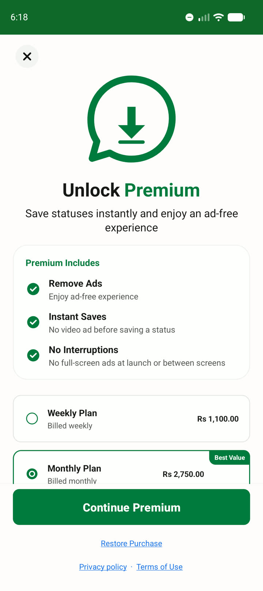

**Paywall**Three true benefits, plans, Restore, Privacy and Terms

Screenshots

## Captured during testing

Emulator captures from this QA round. Tap any screen to enlarge it.

### First run

5 screens

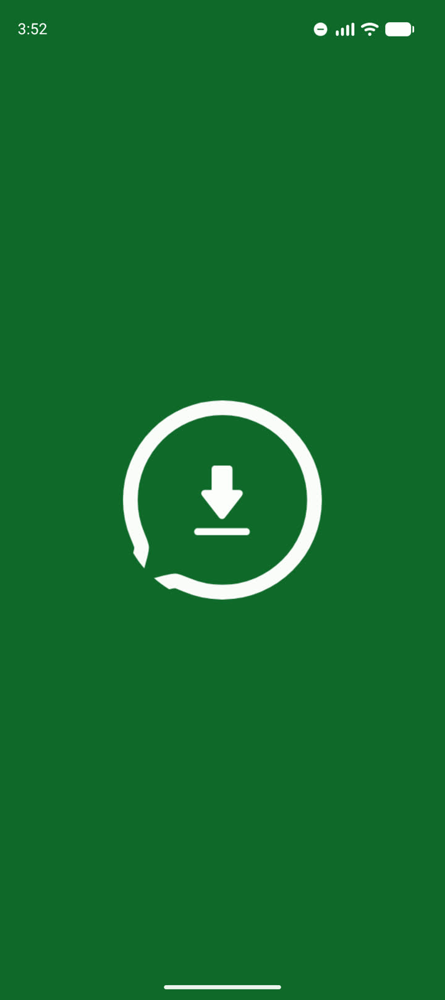

**Splash**Consent and app-open ad

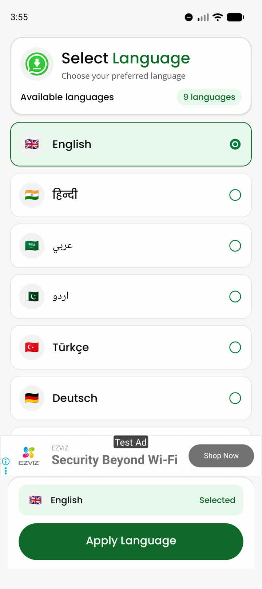

**Language**9 languages, banner below the list

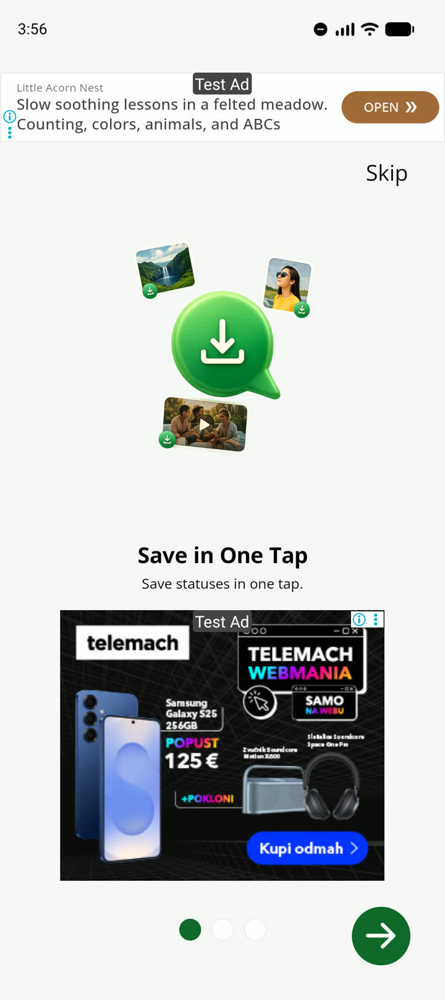

**Onboarding**Before fix round 2: Next 24 dp under the MREC

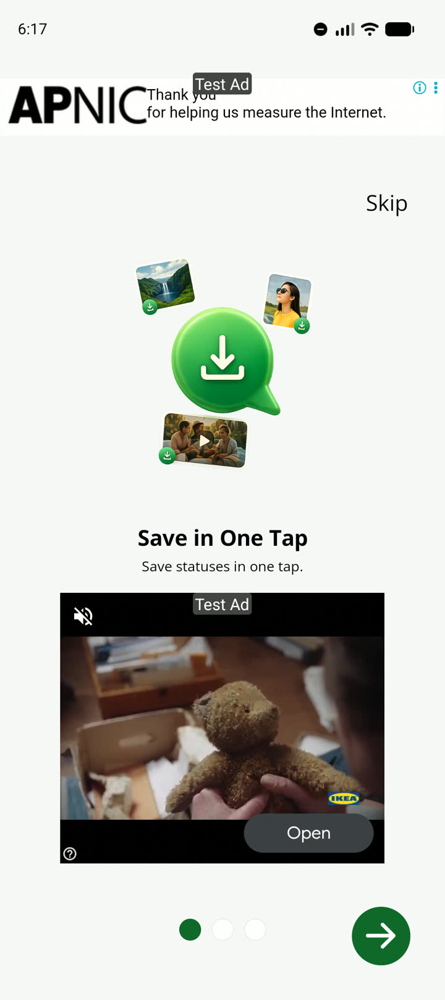

**Onboarding · now**32 dp clear space around the ads

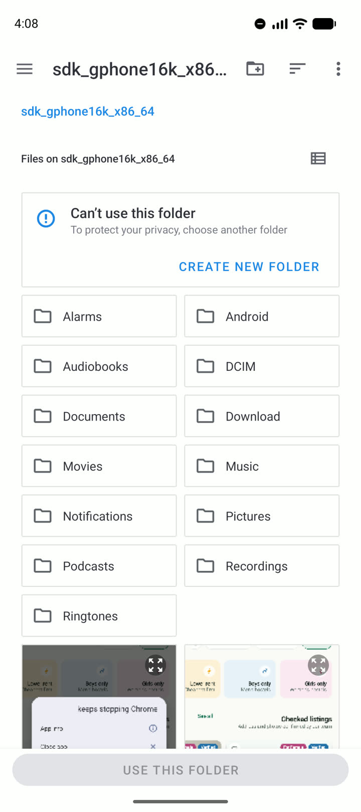

**Folder access**Picker opens straight at .Statuses

### Core flow

8 screens

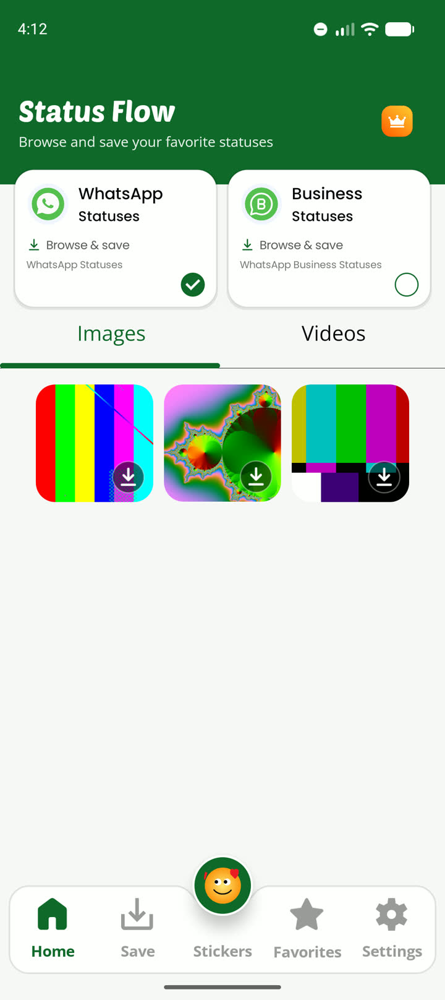

**Home**WhatsApp images

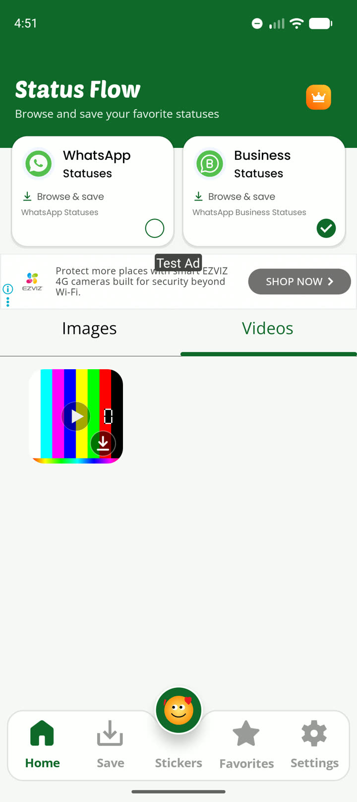

**Business videos**Second source works the same way

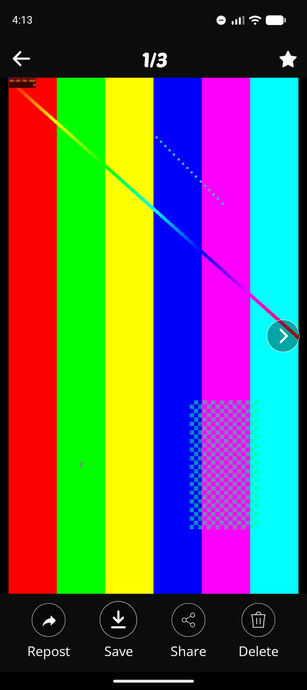

**Viewer**Repost, Save, Share, Delete

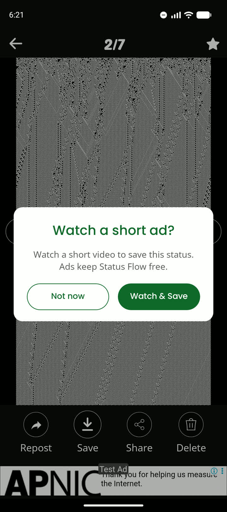

**Save from the tile**Badge tap → opt-in → saved

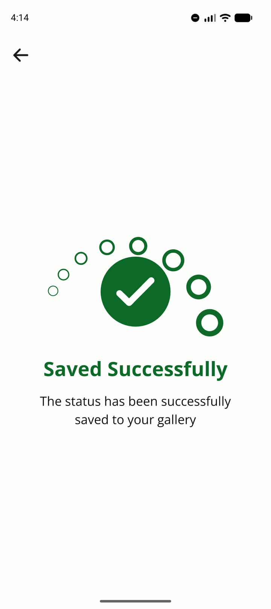

**Saved**File matches the original byte for byte

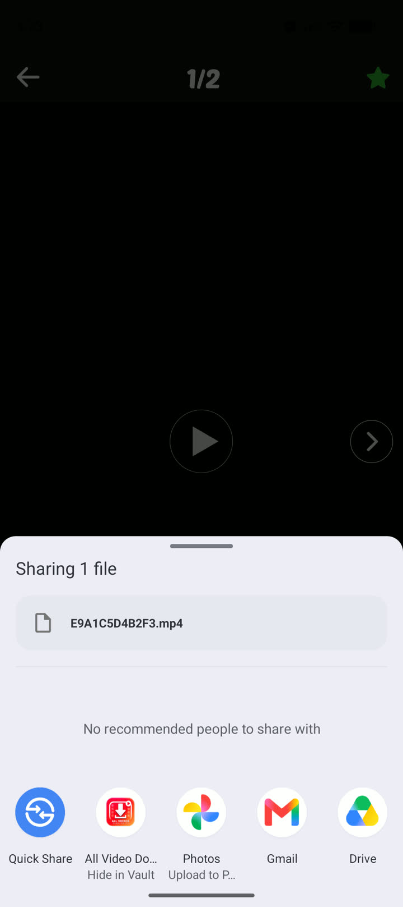

**Share**System share sheet

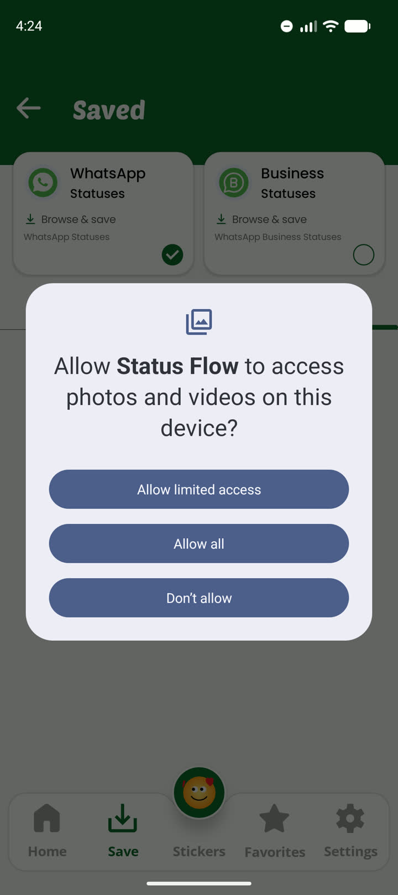

**Saved list**Saved images and videos

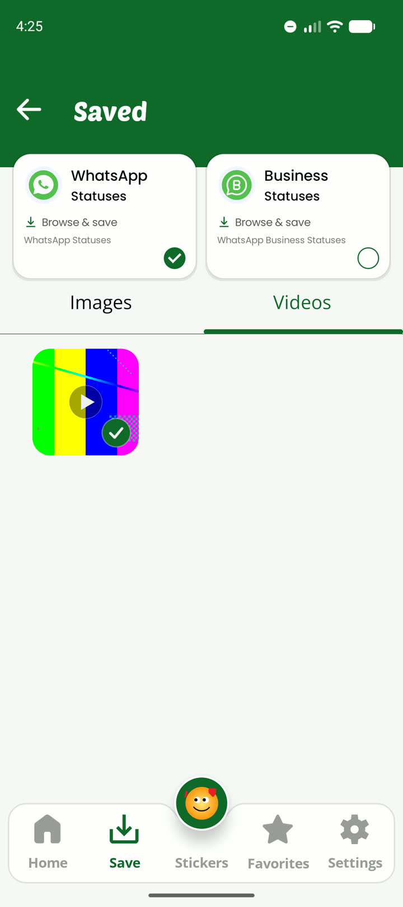

**Saved list**Before round 2, with the media permission denied

### Stickers, settings, conditions

7 screens

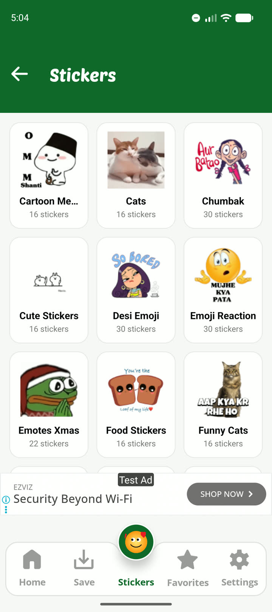

**Stickers**Bundled packs

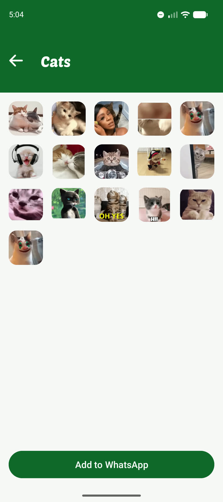

**Sticker pack**Add to WhatsApp

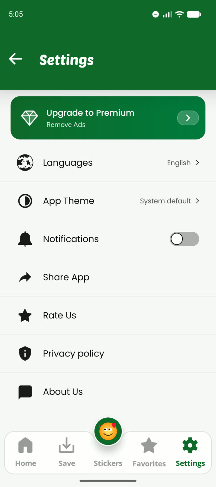

**Settings**Premium tile, theme, language, notifications

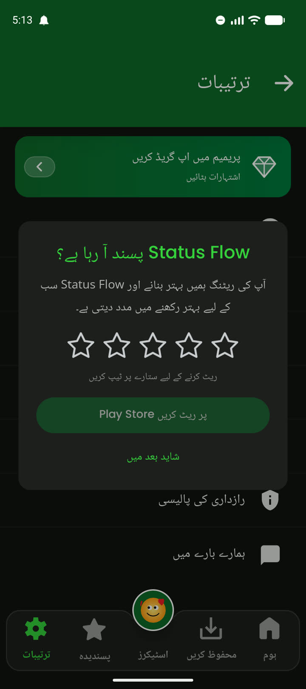

**Rate us**Before round 2 (Urdu, dark)

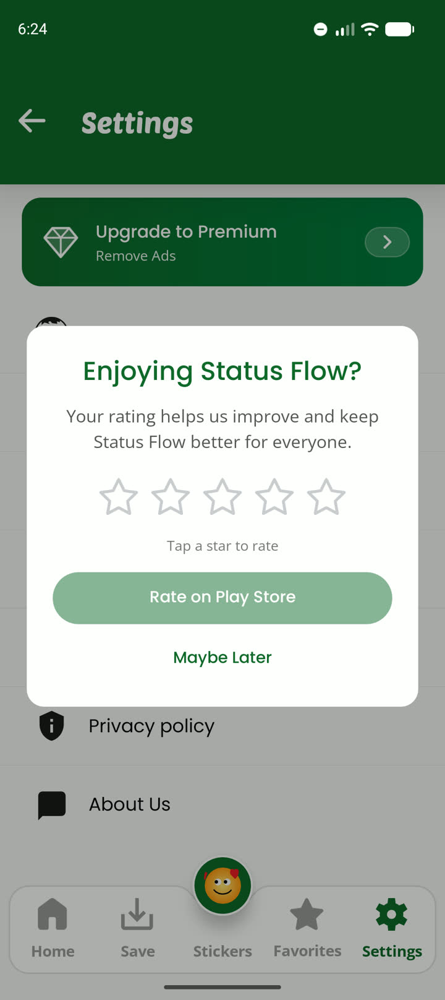

**Rate us · now**48 dp stars, same drawn size

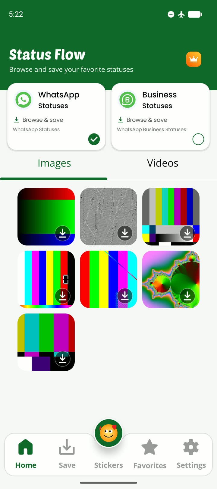

**Offline**Home in about 6.7 s with no network

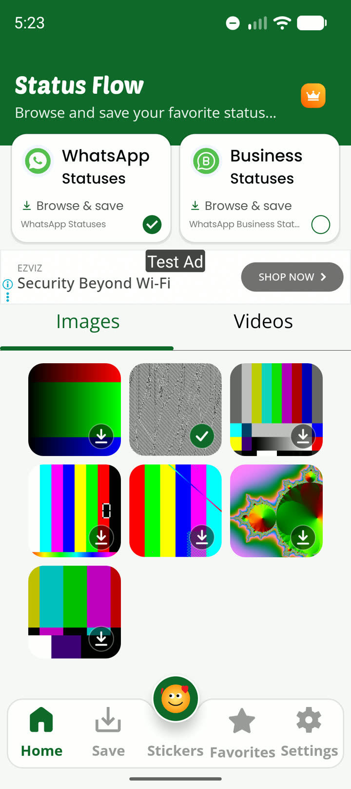

**130% font**No clipped text on Home

### Urdu (RTL) and dark theme

2 screens

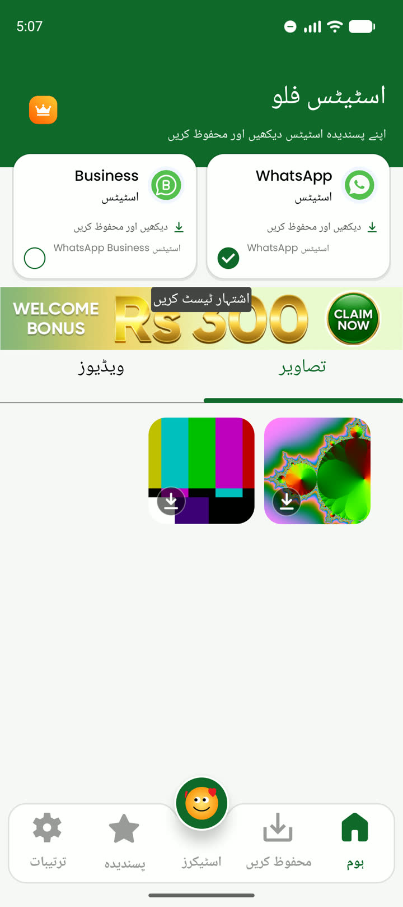

**Home · Urdu**Mirrored layout

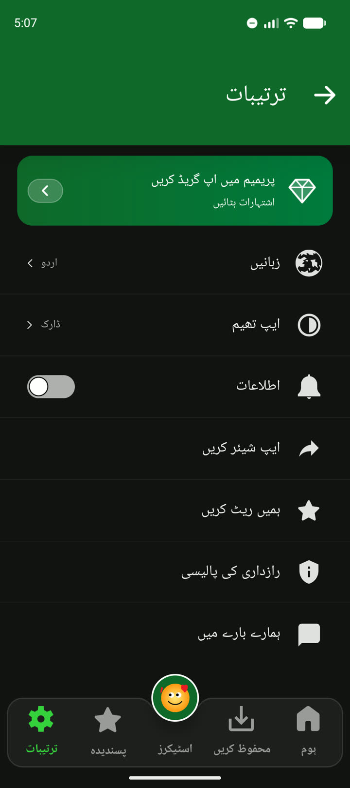

**Settings · dark**Readable text in dark theme

Graphics

## Brand assets and store readiness

**Launcher icon**

192 × 192 PNG (xxxhdpi)

512 × 512 Play icon not in the repo

1024 × 500 not in the repo

**Feature graphic**

Required by Play

Missing locally

Palette, sampled from the icon and the app

Icon green · `#36D03C` · Icon average · `#4FD655` · App green · `#007A3D` · Toolbar green · `#116B2E` · Bubble white · `#FFFFFF`

The Play listing's own graphics were not checked in this round.

QA history

## One emulator, nineteen categories, thirteen fixes

Every finding from the 17 Sep 2026 audit, counted once. Saved files were compared with the originals by size, deletes were checked on disk and in MediaStore, and ad fixes were checked in the ad log.

Bugs found · **15** · Across 2 QA rounds, 17 Sep 2026 · Fixed · **13** · 87% fix rate · 1 awaiting a device check · Still open · **2** · 0 critical, 1 high, 1 medium, 0 low · reasons below · QA score · **84 / 100** · Target 90 · started at 84

Fixed vs open · all rounds · 13 fixed · 2 open · Fixed 13 · Open 2 · Open bugs by severity · Critical · **0** · High · **1** · Medium · **1** · Low · **0** · Not rated · **0**

| QA round | Found | Fixed | Open | Fix rate |
| --- | --- | --- | --- | --- |
| **19-category audit** 17 Sep 2026 · v1.8.0 (9) debug · Pixel 10 emulator, Android 17 | 15 | 13 | 2 | 87% |
| **Fix round 2 · all open items** 17 Sep 2026 · v1.8.0 (9) debug round-2 build · Pixel 10 emulator, Android 17 | 0 | 0 | 0 | 100% |
| Total | 15 | 13 | 2 | 87% |

### Why 2 bugs are still open

What is still open, and why

### Outside the app code

H1 · M1

The app-side part is done; what is left is a console action (Play Console key reset, AdMob unit), not app code.

2

QA score · out of 100

Audit (emulator), 2026-09-17 · **84**

Fix round 1 (6 fixed), 2026-09-17 · **84**

Fix round 2 (13 fixed), 2026-09-17 · **84**

0 · 50 · 90 target · 100

How the score works: each of the 18 scored categories starts at 100 and loses 25 per open critical, 12 per high, 6 per medium, 2 per low and 4 per unrated bug, 3 per fix not yet checked on a device, and 5 per planned test that could not be run. The total is the average, capped while serious items remain: at most 69 with an open critical, 84 with an open high, 94 with an open medium, 95 with an unrated bug, 98 with an open low, and 99 until every fix is device-checked and every planned test has run. Now: average 98, capped at 84 (1 open high bug). Not scored: Load (no server-side component to load).

| Category | Score | Why not 100 |
| --- | --- | --- |
| Functional | 91 | −6 M1 open (medium) −3 M2 fixed, not device-verified |
| UI | 100 | — |
| UX | 100 | — |
| Compatibility | 95 | −5 not tested: Emulator only (Pixel 10 AVD, Android 17, 411x923 dp). No real phone, no Android 8–16, no tablet or small screen this round. |
| Installation | 100 | — |
| Performance | 95 | −5 not tested: Emulator figures are not device figures: startup, jank and memory measured here are indicative only. |
| Load | — | no server-side component to load |
| Stress | 100 | — |
| Network | 100 | — |
| Security | 88 | −12 H1 open (high) |
| Usability | 100 | — |
| Regression | 100 | — |
| Smoke | 100 | — |
| Sanity | 100 | — |
| Interrupt | 100 | — |
| Battery | 95 | −5 not tested: Battery drain cannot be measured on an emulator. |
| Permission | 100 | — |
| Localization | 100 | — |
| Accessibility | 100 | — |

### Fix round 2 · the nine open items

Checked on the emulator · 17 Sep, 18:14 build

The owner asked for all nine open items. Seven are fixed and checked. H1 and M1 are fixed on the app side and now wait on a console action.

**H3 · before**Next 24 dp under the MREC, Skip 4 dp under the banner

**H3 · after**32 dp and 40 dp of clear space

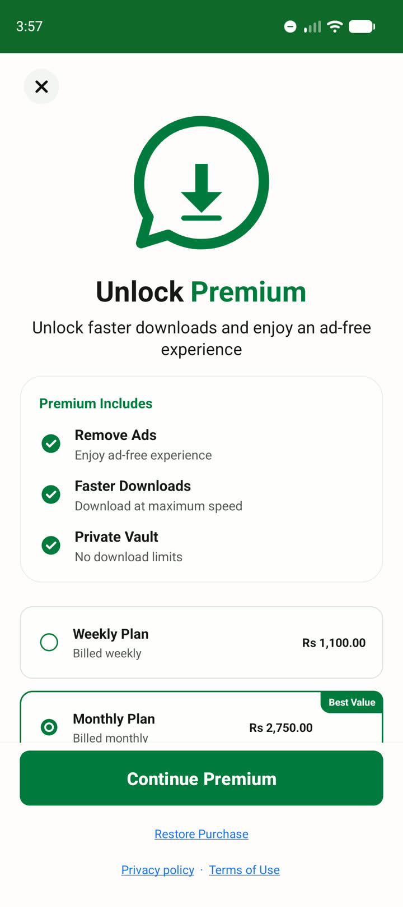

**H4 · before**Faster Downloads, Private Vault

**H4 · after**Three benefits the app delivers

| Bug | Before | After |
| --- | --- | --- |
| **H1** Signing key in git | Key and password tracked and pushed | Untracked and ignored (files kept on disk) · *key still in history: reset the upload key in Play Console* |
| **H2** Media permissions | READ_MEDIA_IMAGES/VIDEO declared and requested | Not in the APK; no prompt on Saved or Favorites; saved list and delete still work |
| **H3** Ads next to buttons | Skip 4 dp, Next 24 dp from the ads | Skip 32 dp, Next 40 dp |
| **H4** Paywall claims | 2 of 3 benefits did not exist | 3 true benefits, 9 languages |
| **M1** Home native ad | 3 doomed requests per session | 1 request, then skipped · *AdMob unit still the wrong format* |
| **L2** Test device id | Infinix id in the code | Per machine in local.properties; 0 matches in the APK |
| **L3** Tile download badge | Opened the viewer only | Saves in one tap (opt-in when an ad is ready); 2 files saved byte-identical |
| **L4** Small or unlabeled controls | 6 findings | Back labelled; 48 dp touch areas on back, badges, tabs, switch row, arrows, stars |
| **L5** Favorites label | 5 px (2 dp) lower | 1 px (rounding) |

Regression on the same build: first run from a data clear, folder access for both apps, delete of a saved file (gone from disk and MediaStore), Business video saved at 169,020 bytes, 0 crashes and 0 ANRs.

### H5 · ads after the app is restored

Fixed and checked on the emulator · 17 Sep

When Android killed the app in the background and later restored it straight onto Home, the splash never ran, so ad consent was never checked and no ad loaded for the rest of the session.

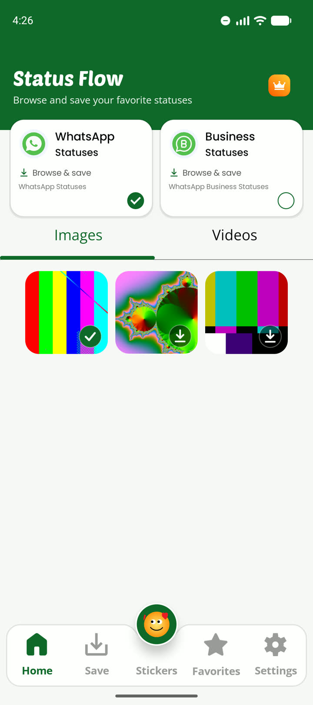

**H5 · before**Restored Home, no ads all session

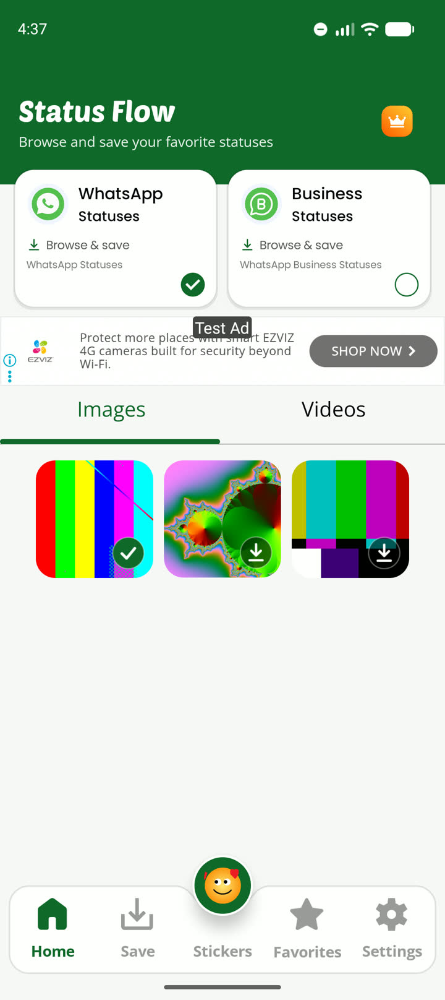

**H5 · after**Consent resolved on Home, banner loads

| Check | Before | After |
| --- | --- | --- |
| Ads after a restore | Every placement skipped: consent not granted | Consent in 1.5 s, SDK ready 2.1 s later, banner shown |

Method: home, am kill, relaunch from recents. Ads on (live units serving as test ads).

### M3, M4, M5 · before and after

Fixed and checked on the emulator · 17 Sep

M3: the viewer zoomed every video to fill the screen, so a 1280×720 status lost most of its picture. M4 and M5 below.

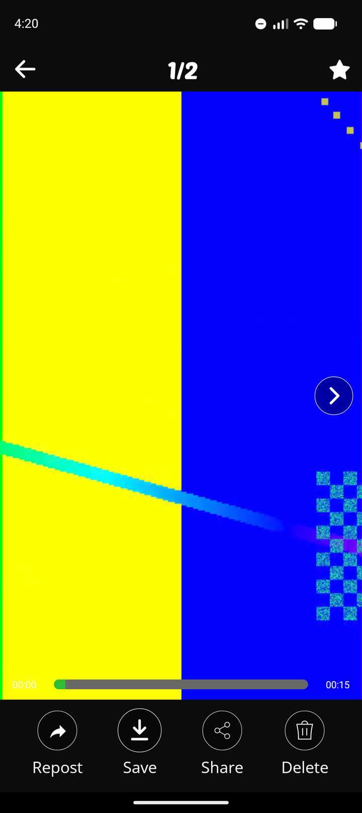

**M3 · before**Only two of seven colour bars visible

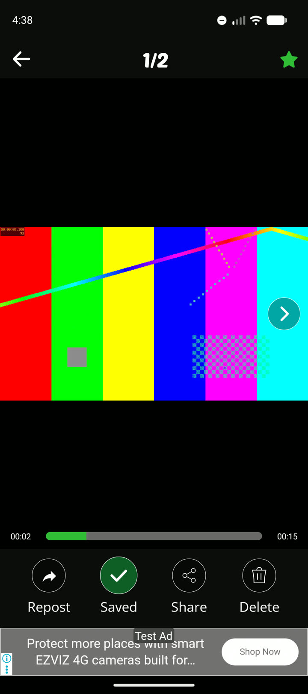

**M3 · after**Whole frame, letterboxed

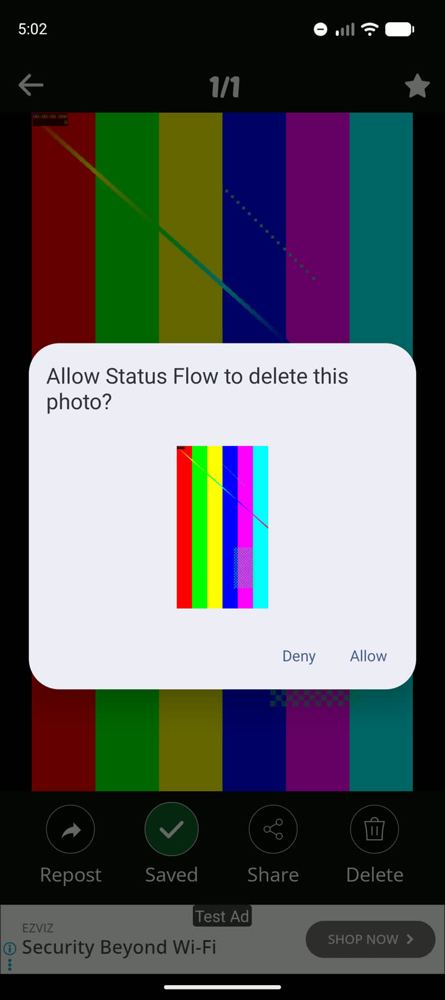

**M4 · after**The delete permission dialog

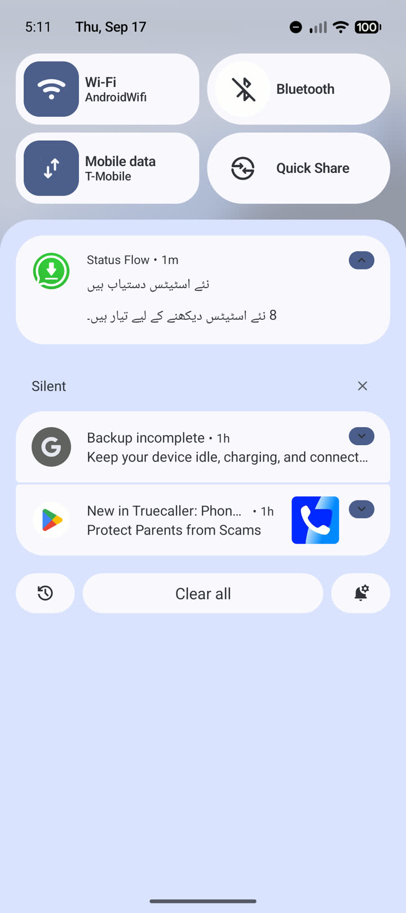

**M5 · before**“8 new statuses” after switching on

| Bug | Before | After |
| --- | --- | --- |
| **M4** Delete a status saved before a reinstall | Only a “delete failed” toast; file stays on disk and in MediaStore | System “Allow … to delete?” dialog; Deny keeps it, Allow removes it from disk and MediaStore |
| **M5** New-status notification | “8 new statuses” with one actually new | Silent first scan, then “1 new” for one new status |
| **M2** Splash app-open requests | Duplicate request while the first was still loading; show skipped, both ads wasted | 1 request per start in 5 cold starts, all shown · *slow-fill case not reproduced* |
| **L1** Arabic notification text | Garbled word | Correct text in the APK resources · *notification not shown in Arabic* |

Same test files and the same emulator before and after.

### Performance and stress

Emulator figures · indicative only

Measured on the final QA build with ads on.

| Measure | Result |
| --- | --- |
| Cold start, online (3 runs) | 1,738 · 2,002 · 1,791 ms |
| Cold start, offline (3 runs) | 1,452 · 1,869 · 1,684 ms |
| Rapid tab switching, 4 cycles × 10 rounds | PSS 204 → 250 → 252 → 232 → 234 MB · views steady at 249 · no leak |
| 5 min in background | Process ended by a WebView crash that also hit Chrome at the same second; app reopened normally |
| Crashes and ANRs in app code | 0 |

The background crash was a native SIGILL in Chromium's memory-trim code, seen in Chrome too, on this Android 17 emulator image. It is not in the app's code and was not seen elsewhere.

1. 17 Sep · Fix round 2 · The owner asked for all nine open items. Seven are fixed and checked, and H1 and M1 are fixed on the app side. The score stays at 84 until the upload key is reset in Play Console, because a leaked key stays in git history. Changes are not committed.
2. 17 Sep · Fix round 1 · Six of 15 findings fixed; five checked on the emulator, M2 fixed but its slow-fill case could not be recreated. Final smoke passed: an image and a Business video saved byte-identical, no crashes. Score stays at 84 while four high findings wait on the owner. Changes are not committed.
3. 17 Sep · 19-category audit · 15 findings (5 high, 5 medium, 5 low) on a Pixel 10 emulator with Android 17. Started at 84, capped by the open high findings.

Fixed in 19-category audit · 13

- **H2** READ_MEDIA_IMAGES / READ_MEDIA_VIDEO requested for a secondary need (Play photo-and-video policy risk)
- **L1** Arabic new-status notification has a garbled word
- **L2** Debug builds on the Infinix test phone always receive test ads
- **M2** Splash app-open ad is skipped on slow starts, and two ad requests are wasted every time *(device check pending)*
- **H3** Onboarding Next and Skip buttons sit right next to ads (accidental-click risk)
- **H4** Paywall sells two premium benefits the app does not have
- **H5** No ads for the whole session after Android restores the app from the background
- **L3** The download icon on a status tile opens the viewer instead of saving
- **M3** Landscape status videos are cropped in the viewer; most of the picture is cut off
- **M4** Saved statuses from before a reinstall (or data clear) can never be deleted
- **M5** New-status notification is wrong: announces old statuses as new, and misses real ones
- **L4** Several controls are below 48 dp or unlabeled
- **L5** Bottom-nav “Favorites” label sits lower than the other four

Release to-do (not counted as bugs)

Commit the QA fixes (the key folder removal is staged); reset the upload key in Play Console and keep the new key outside the repo (H1); create a Native ad unit and publish its id to SS1_home_RMB_id (M1); make a 512 × 512 icon and a feature graphic; test on a real phone with real WhatsApp; build a signed release AAB.

Status Flow 1.8.0 (9) · compiled 17 Sep 2026 (updated after fix round 2) from the WhatsAppStatusSaver repository (branch development/dev_1.8.0(9)), testing on a Pixel 10 emulator with Android 17, and Google Play listings checked the same day.
