# Competitor’s Graphics

> **Generated file: do not edit by hand.** Full visible text of the tab as it renders by default, produced by `node tools/export-docs.js`, which GitHub runs after every push.
> Live page: https://zaeem-ahmad-growth.github.io/Status-Saver-App/tabs/05-competitors-graphics/ · Source: [tabs/05-competitors-graphics/index.html](../../tabs/05-competitors-graphics/index.html) · Drawn by [assets/app.js](../../assets/app.js) from [assets/data.js](../../assets/data.js) · Where each section comes from: [code map](../code-map.md#05-competitors-graphics)
> Controls on the page (market pickers, version switches, filters, "show more") change the view; this snapshot shows their default state. The data behind every state is in [assets/data.js](../../assets/data.js), described in the [data dictionary](../data-dictionary.md).

Store graphics · status savers · read from Google Play

# Competitor’s Graphics

The icons, feature graphics and screenshots the shelf holders are running right now, saved from their live listings. This is the visual shelf our icon has to stand next to in a search result, so the patterns here are the ones a buyer's eye is already trained on.

9 listings · 9 icons · 9 feature graphics · 48 screenshots · saved from Google Play on 2026-09-23

Icons

## Every icon side by side

How the shelf looks in a result list. Hover an icon for the app and its installs.

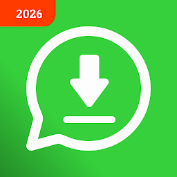

Status Downloader · 10+

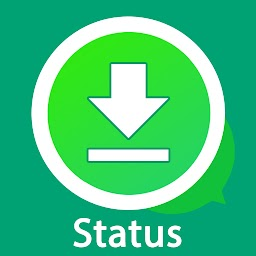

Status Download · 100M+

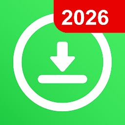

Status Saver · 50M+

Status Saver · 100M+

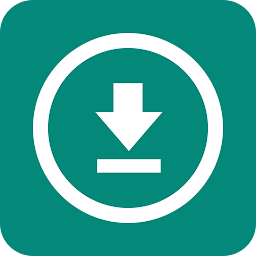

Status Saver · 10M+

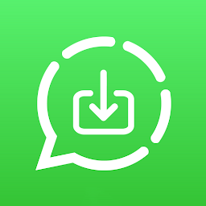

Status Saver · 500K+

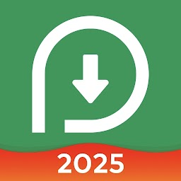

Status Saver · 10M+

Status Saver & Video Download · 100+

Status Saver · 100K+

### Eight of the nine icons are green

The shelf has one colour. Eight icons sit on the same messaging-app green, six of them on an almost identical gradient. The only app that breaks it — Status Saver & Video Download, on a dark teal-to-black gradient with a glowing ring — is the one icon you can pick out of a result list at a glance.

### Every icon is a downward arrow

All nine draw the same symbol: a down arrow, seven of them inside a white ring or circle, four with a chat-bubble tail. The category has a universal glyph, so the arrow is not a decision — what surrounds it is.

### A year badge is a shelf habit, not a differentiator

Three icons carry a year: ours and one competitor stamp a red 2026 corner, another a 2025 band. It reads as freshness for a moment and as clutter at 48 px, and it dates the icon the day the year turns.

### Our icon is the closest twin on the shelf

Ours — white bubble outline, down arrow, underline, red 2026 corner, green field — is very nearly the same drawing as Status Saver: Video Downloader, which holds 88 top-10 slots and has 50M+ installs. Sitting next to it in a result list, our icon reads as the same app with fewer reviews.

Feature graphics

## Every feature graphic

The 1024 × 500 banner at the top of each listing — the one asset our app does not have yet.

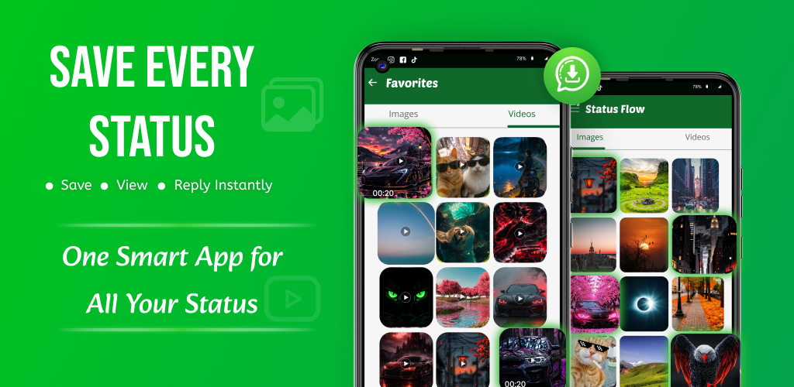

Status Downloader ours · 10+ installs

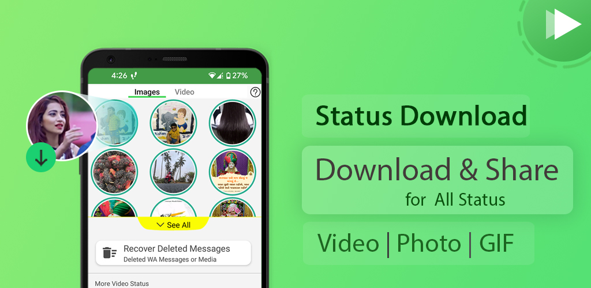

Status Download · 100M+ installs

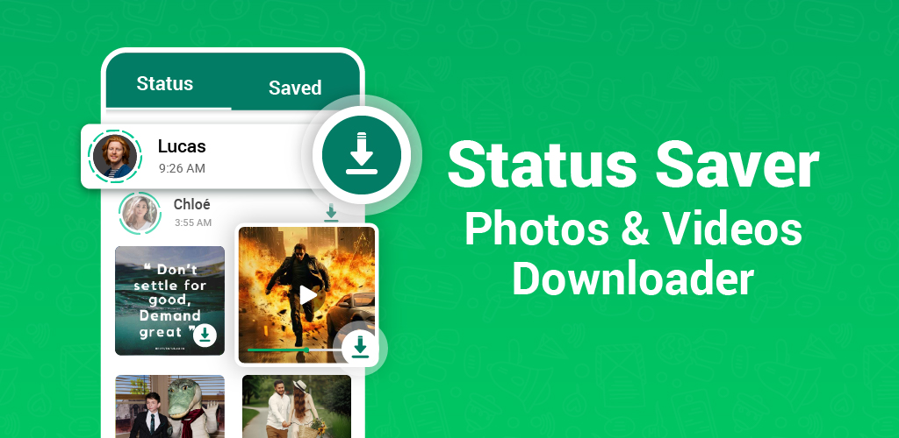

Status Saver · 50M+ installs

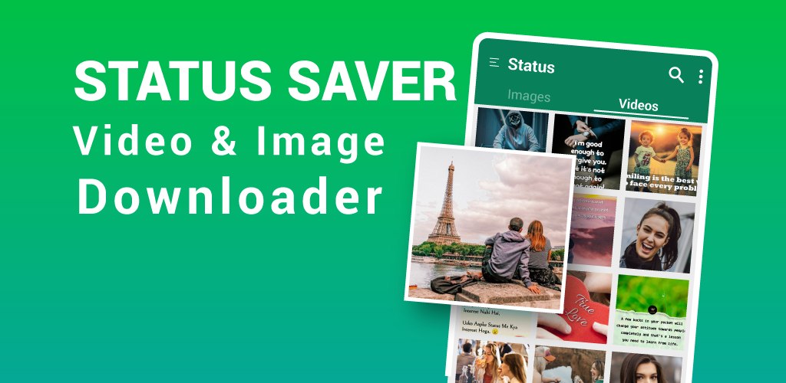

Status Saver · 100M+ installs

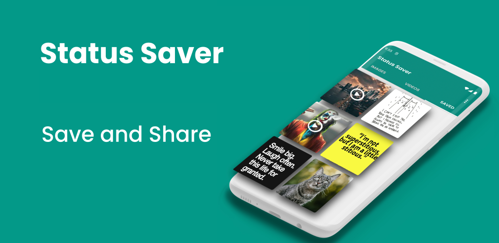

Status Saver · 10M+ installs

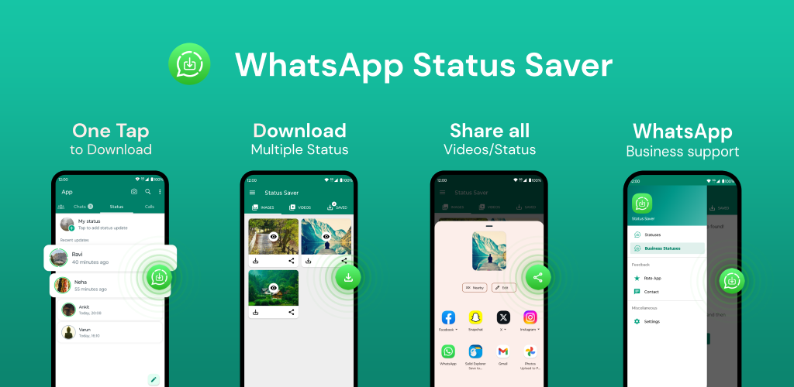

Status Saver · 500K+ installs

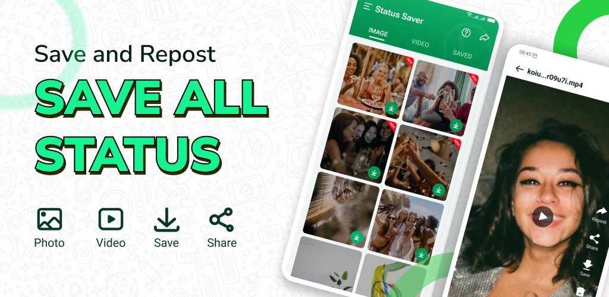

Status Saver · 10M+ installs

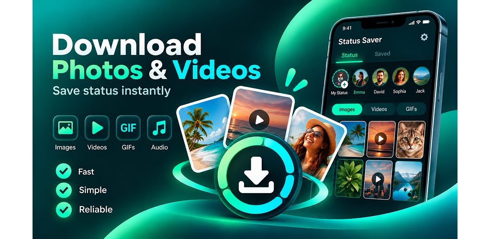

Status Saver & Video Download · 100+ installs

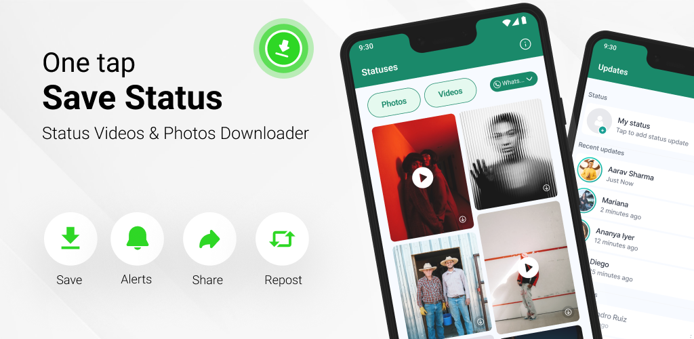

Status Saver · 100K+ installs

### One template, eight times

Headline left, phone mock right, category phrase as the headline: "Status Saver", "Status Download", "Save All Status", "One tap Save Status". Nobody sells a brand here; everybody sells the job.

### The two that stand out do it by leaving the green

Status Saver & Video Download uses a dark teal field with a 3D-rendered download ring and labelled chips (Images, Videos, GIFs, Audio). Status Saver: Video Downloader (Sino) uses a white field with four labelled action circles — Save, Alerts, Share, Repost. Both read cleanly at thumbnail size; the green-on-green ones blur together.

### Two competitors put a policy risk straight into the art

One feature graphic prints "WhatsApp Status Saver" as its headline and shows the Facebook, Snapchat, X, Instagram and Gmail logos inside a phone mock. Another shows a "Recover Deleted Messages" row in its screenshot. Both are exactly what our rules and Play's impersonation policy tell us not to do — and useful evidence that doing it is survivable for them but not a model to copy.

### Ours already competes on craft — and overclaims

Our feature graphic is one of the stronger ones: a clean headline, a readable subhead and two phone mocks of the real grid. But its bullets say "Save · View · Reply Instantly", and the app has no reply or direct-chat feature at all. That is a claim the listing cannot support.

Screenshot systems

## How the shelf builds a screenshot set

The repeatable system behind each set: caption placement, device framing, colour and what the first screen leads with.

| App | First screen shows | Caption | Framing | Read |
| --- | --- | --- | --- | --- |
| **Status Downloader: Video Saver** | Splash screen with the app logo | Two-line caption above the phone, green on pale blue | Purple-framed phone, blurred teal background | Leads with the wrong screen, and the mock status bar carries the Instagram, Facebook and TikTok logos |
| **Status Download - Video Saver** | The messaging app's own status list | "One Tap to Download All", white on green | Dark phone frame, flat green field | Sells the source, not the app; a giant download button is composited over the list |
| **Status Saver: Video Downloader (BlueLine)** | The app's own status grid with download badges | "Instant Save Status", white on green | Frameless white card on green | Cleanest read of the shelf: the product does the talking, one benefit per screen |
| **Status Saver - Video Saver** | The app's grid, full of real status images | "SAVE ALL STATUS", white on green | Light phone frame on flat green | Content is localised — Hindi and Hinglish status cards — which sells the market it is aimed at |
| **Status Saver・Status Downloader (Falnesc)** | The app's grid of quote and photo statuses | "Save Status", white on teal | White phone frame, generous margin | The most restrained set: one word of caption, no badges, no arrows |
| **Status Saver - Video Download (Heethjain)** | The messaging app's status list | "One Tap to Download", white on teal gradient | Dark phone frame with a pulsing action button | Four-panel feature graphic doubles as the screenshot script |
| **Status Saver (Lite)** | The app's saved tab with story rings | "Save All Status", black on a doodle background | Rounded light frame, doodle pattern field | The only set with an illustrated background instead of a flat colour |
| **Status Saver & Video Download (MDTech)** | The app's grid with floating media cards | "Save Your Moments" plus a three-line subhead | 3D-tilted dark phone, deep teal field | The most designed set on the shelf, and the only one that states Fast / Simple / Reliable as badges |
| **Status Saver: Video Downloader (Sino)** | The app's grid with a NO ADS ribbon | "One tap Save Status", black on white | Dark phone frame on white | Uses the screenshot to make a commercial promise, not a feature claim |

Catalogue

## Every asset, app by app

Each app's icon, feature graphic and full screenshot set, with a read on what the design is doing. Click any screenshot to enlarge it.

### Status Downloader: Video Saver our app

Cell Cave · 10+ installs · no rating yet

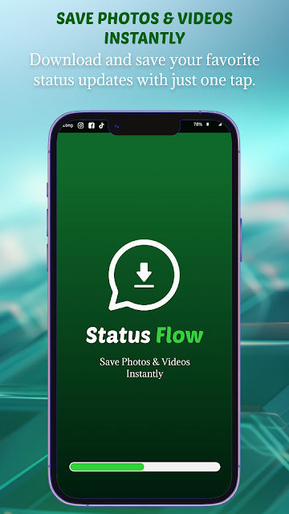

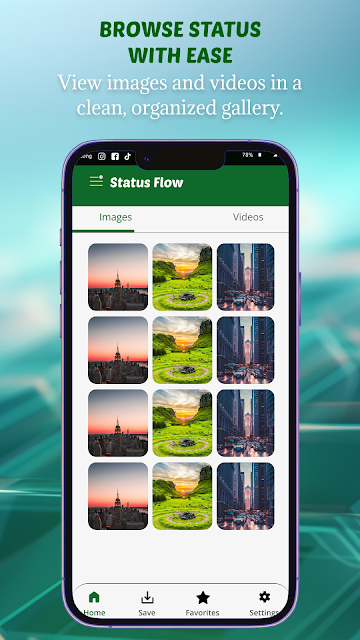

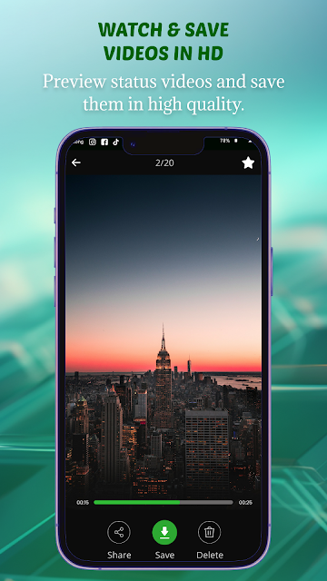

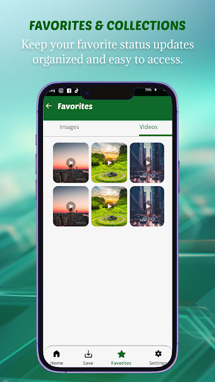

### Status Download - Video Saver

Shree Ganesha Labs · 100M+ installs · 4.6★ (1.7M)

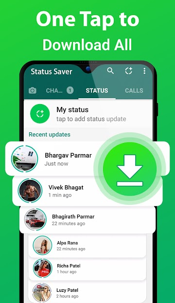

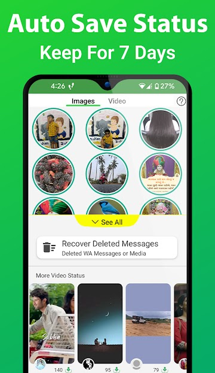

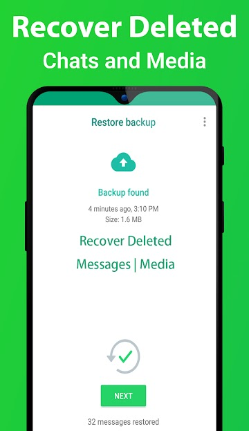

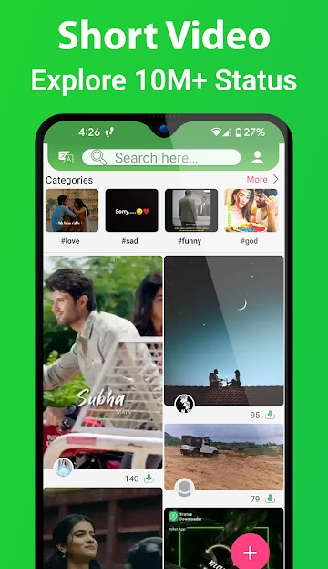

### Status Saver: Video Downloader

BlueLine. Tech · 50M+ installs · 4.8★ (205K)

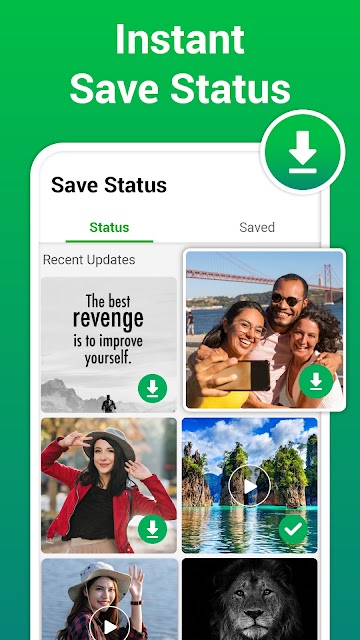

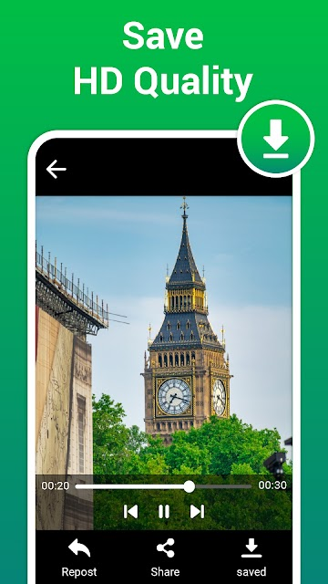

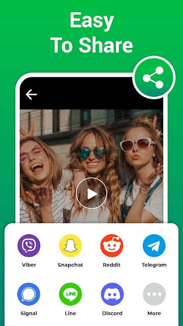

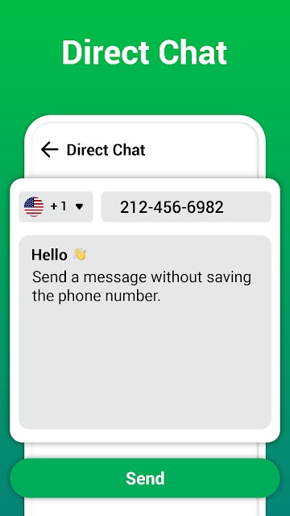

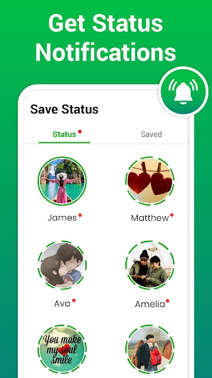

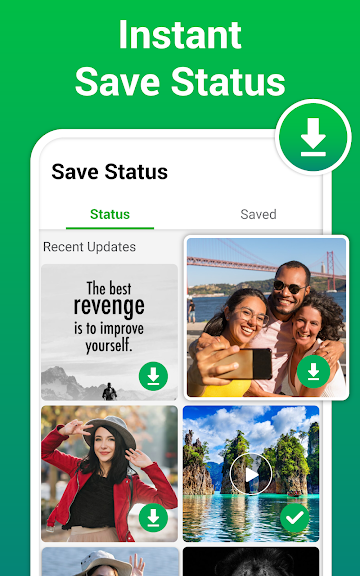

### Status Saver - Video Saver

Save Status, Video & Image Downloader · 100M+ installs · 4.6★ (275K)

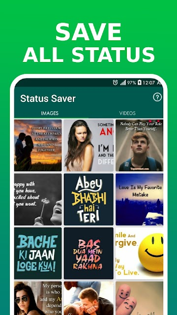

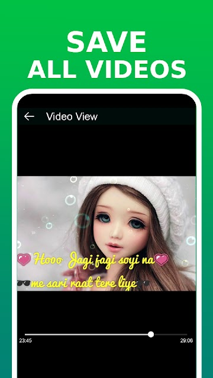

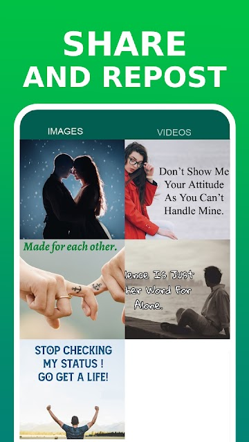

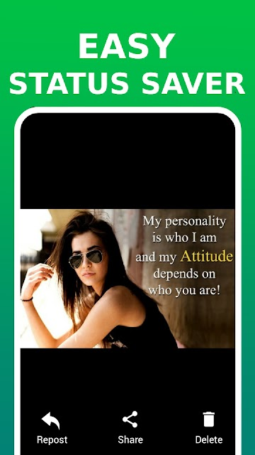

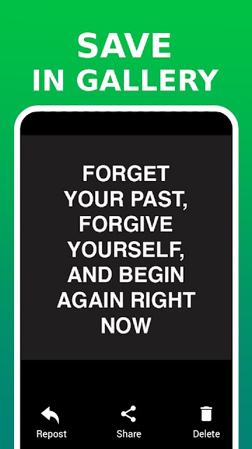

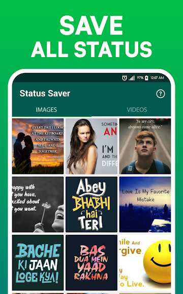

### Status Saver・Status Downloader

Battery Stats Saver · 10M+ installs · 4.8★ (226K)

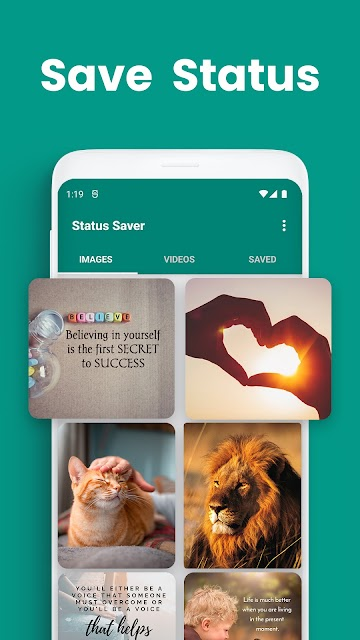

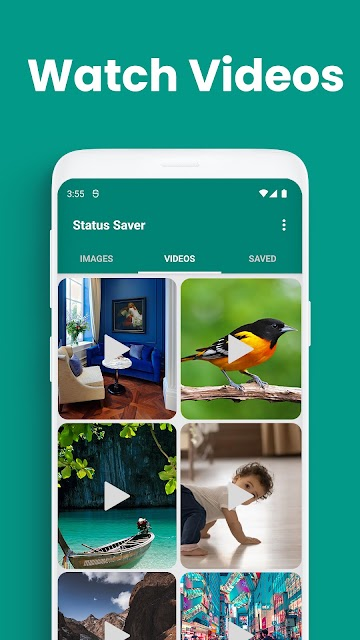

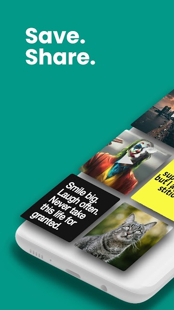

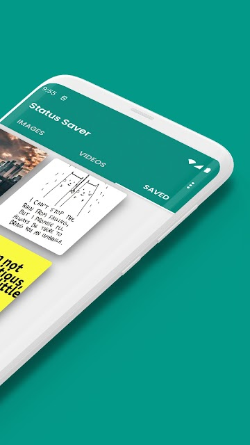

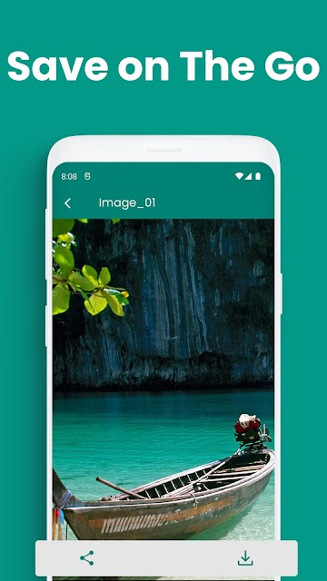

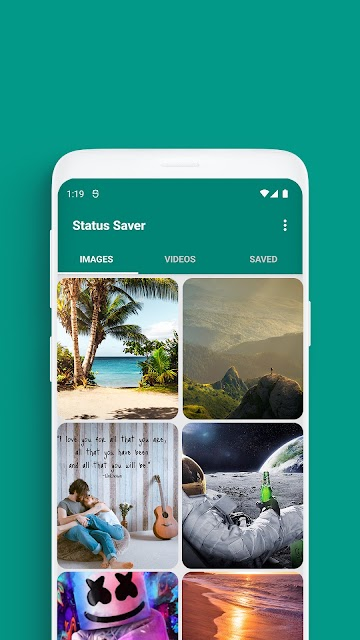

### Status Saver - Video Download

Heeth Jain · 500K+ installs · 4.4★ (7K)

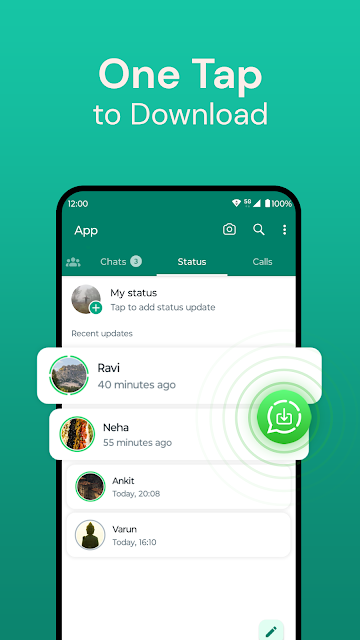

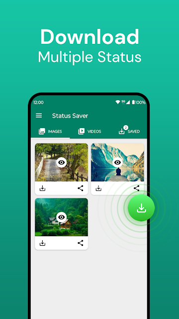

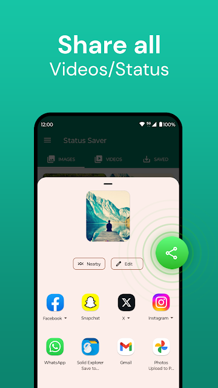

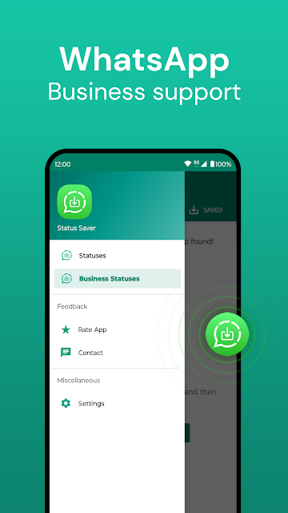

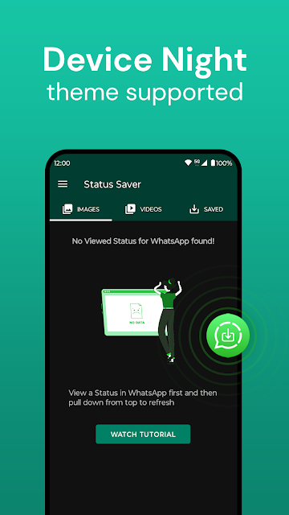

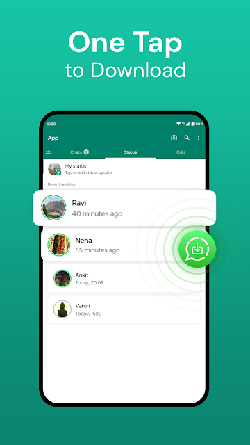

### Status Saver

Fun and Hi Tool · 10M+ installs · 4.3★ (7K)

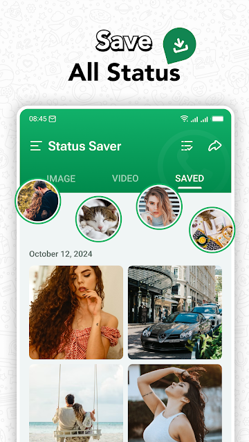

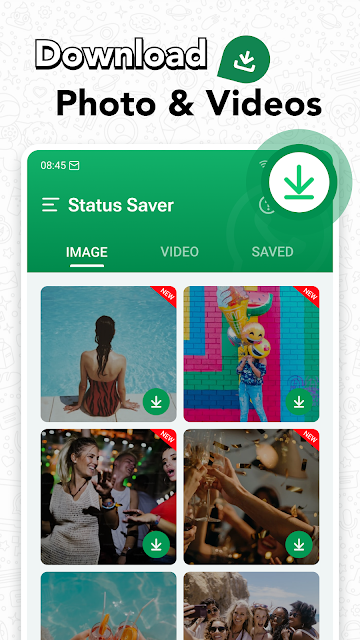

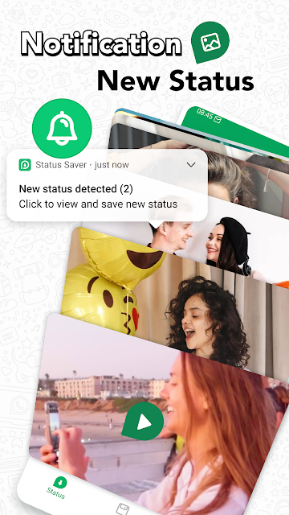


### Status Saver & Video Download

MD TECH · 100+ installs · no rating yet


### Status Saver: Video Downloader

SinoSystems, Inc · 100K+ installs · no rating yet


For our listing

## What our graphics should do

What to copy, what to avoid, and what our listing is missing today.

### Do not lead with the splash screen

Our first screenshot is the app's own loading screen: a logo and a progress bar. Every competitor leads with content — their grid, or the status list they read from. The first screenshot is the one most people see; it should show a grid full of statuses with save badges, captioned with the benefit.

### Take the platform logos out of the store assets

Our screenshots and feature graphic show a mock status bar carrying the Instagram, Facebook and TikTok logos. Those are other companies' brand marks in our own store art. It breaks our own rule, it is the kind of thing Play's impersonation policy exists for, and it promises sources the app does not read.

### Fix the "Reply Instantly" claim

The feature graphic promises a reply feature the app does not have. Replace it with something true and specific that the shelf does not say: original quality, favourites, or nine languages.

### Use real, varied content in the mocks

Our grid screenshots repeat the same three stock photos in a 4×3 tile. Competitors fill the grid with different images, which is what a real status feed looks like. The repetition reads as a mock-up, not an app.

### Break the green

Eight of nine icons are the same green with the same white arrow, and ours is the closest twin of a 50M-install competitor. The two apps that stand out on this shelf did it by leaving the colour, not by redrawing the arrow. A distinct field colour is the cheapest differentiation available, and it costs nothing but a re-export.

### Ship the missing sizes

The 512 × 512 Play icon and the 1024 × 500 feature graphic are live on the listing but absent from the app repository, so nobody can re-export or version them. Put the sources next to the app, not only on the store.

Google Play data read on 2026-09-23 in US, PK, IN · 110 keywords · 217 listings · collected by the scripts in [research/aso-pipeline](https://github.com/zaeem-ahmad-growth/Status-Saver-App/tree/main/research/aso-pipeline). Ranks move daily.
